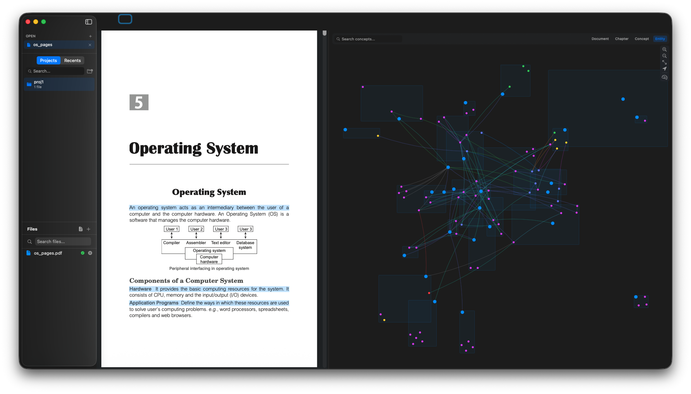

# Atlas

A native macOS PDF reader that builds a live, AI-generated knowledge map as you read. Open any PDF and Atlas extracts concepts, definitions, theorems, and relationships - rendering them as an interactive force-directed graph linked back to every source passage. Add multiple PDFs to a project and Atlas merges shared concepts across documents, revealing connections you'd otherwise miss.

Built entirely with Apple frameworks. No Electron, no web views, no external dependencies.



## Features

- **PDF Viewer** - Full-featured reader with text-selection highlights, area annotations, search, bookmarks, thumbnails, multi-tab, comparison mode, print, and undo/redo
- **Knowledge Map** - AI extracts concepts from your PDFs in 5-page batches and renders them as a force-directed graph (Fruchterman-Reingold) with semantic zoom levels: document → chapter → concept → entity
- **Bidirectional Sync** - Scroll the PDF and the active concept lights up on the map. Click a map node and the PDF jumps to the source passage with a color-matched pulse highlight
- **Cross-Document Correlations** - Add multiple PDFs to a project. Atlas merges shared concepts across documents using fuzzy matching and optional LLM-powered semantic merge proposals
- **OCR Fallback** - Scanned PDFs with no embedded text are automatically detected; Vision OCR extracts text page-by-page so the AI pipeline can still analyze them
- **Pluggable AI** - Bring your own API key for Claude, OpenAI, Gemini, or run locally via Ollama. API keys stored in macOS Keychain
- **Projects** - Organize PDFs into projects with per-document and batch extraction, correlation stats, and a project-level sidebar showing processing state
- **Export** - Export your knowledge graph to Obsidian (wikilinks), Markdown, or JSON
- **Session Restore** - Persisted graphs load automatically when you reopen a document. Window state and split-pane layout are restored across launches

## Requirements

- macOS 13.0 (Ventura) or later
- Xcode 16.0 or later
- No external dependencies - uses only Apple system frameworks (PDFKit, SwiftUI, AppKit, CryptoKit, Security, Vision)

## Getting Started

### 1. Clone and open

```bash
git clone <repository-url>
cd atlas
open pdf_app1/pdf_app1.xcodeproj
```

### 2. Build and run

In Xcode, select the `pdf_app1` scheme, target your Mac, and press **Cmd+R**.

Or from the command line:

```bash
cd atlas/pdf_app1
xcodebuild -project pdf_app1.xcodeproj -scheme pdf_app1 -configuration Debug build
```

### 3. Configure AI (optional but recommended)

1. Open **Settings** (Cmd+,) → **AI** tab
2. Select a provider: Anthropic Claude, OpenAI, Google Gemini, or Ollama (local)
3. Enter your API key (stored in macOS Keychain)
4. Choose a model (e.g., `claude-sonnet-4-5-20250514`, `gpt-4o`, `gemini-2.5-flash`)

For Ollama (free, local, no API key):
```bash
brew install ollama
ollama pull llama3.1
# Atlas connects to http://localhost:11434 by default
```

### 4. Open a PDF and analyze

1. Open a PDF via the sidebar, Cmd+T, or drag-and-drop
2. The split view shows the PDF on the left and the knowledge map on the right
3. Click **Analyze Document** (brain icon) to start concept extraction
4. Watch the progress bar as concepts appear - cancel anytime
5. Scroll the PDF to see the active node highlighted; click a node to jump to its source

## Keyboard Shortcuts

| Shortcut | Action |
|----------|--------|
| Cmd+1 | PDF only |
| Cmd+2 | Map only |
| Cmd+3 | Split view (default) |
| Cmd+K | Command palette - jump to any concept or page |
| Cmd+F | Search (context-aware: searches whichever pane has focus) |
| Cmd+T | New tab / open file |
| Cmd+W | Close tab |
| Cmd+Z / Cmd+Shift+Z | Undo / Redo |
| Cmd+Shift+D | Comparison mode |

## How It Works

1. **Text Extraction** - PDFKit extracts text with bounding-box coordinates per block. For scanned PDFs, Vision OCR renders each page at 300 DPI and extracts text
2. **Layout Analysis** - Heuristics classify blocks as headings, body, captions, footnotes, or equations
3. **AI Concept Extraction** - Text (with ±2 pages context) is sent to the configured LLM in 5-page batches, which returns structured JSON with concepts, entities, source quotes, and typed relationships
4. **JSON Repair** - LLM responses are cleaned (markdown fences stripped, truncated JSON repaired) before parsing
5. **Source Anchoring** - Each concept's text span is mapped back to a PDF bounding box. Concepts without valid anchors are rejected (hallucination mitigation)
6. **Graph Rendering** - Force-directed layout (Fruchterman-Reingold) with hierarchical grouping positions nodes. Entities are attracted 3x toward parent concepts. SwiftUI Canvas renders with frustum culling and zoom-dependent LOD (dots → boxes → labels → summaries)
7. **Bidirectional Sync** - PDF scroll events update the active node; node clicks navigate the PDF with an 800ms pulse animation and color-coded highlight
8. **Cross-Document Merge** - Within a project, shared concepts across PDFs are identified via Levenshtein similarity (>0.5) with optional LLM semantic matching, and presented as merge proposals

## Project Structure

```
pdf_app1/pdf_app1/
  PDFViewerApp.swift              App entry point, environment injection
  MultiDocumentView.swift         Main UI: sidebar + split pane detail
  PDFViewerView.swift             PDF viewer + annotation engine
  DocumentManager.swift           Multi-tab document state
  ProjectsManager.swift           Project management + bookmarks
  ProjectViews.swift              Project explorer views
  RecentFilesManager.swift        Recent files with security-scoped bookmarks
  UndoRedoManager.swift           Annotation undo/redo stack
  PDFSearchManager.swift          PDF text search engine
  SearchBarView.swift             Search bar UI component
  EnhancedDropView.swift          Multi-file drag-and-drop support
  Constants.swift                 App-wide enums and constants
  AppPreferences.swift            Settings (General, Display, AI)
  AppError.swift                  Error types, severity routing, alerts

  Atlas/
    Models/
      ConceptTypes.swift          ConceptType, EdgeType, ReadingState, PaneMode enums
      KnowledgeGraph.swift        Core graph: ConceptNode, GraphEdge, SourceAnchor
    Persistence/
      GraphStore.swift            Per-document/project JSON persistence (debounced saves)
      GraphMergeEngine.swift      Cross-document entity resolution + LLM merge proposals
    AI/
      AtlasModelProtocol.swift    AI backend protocol (4 operations)
      PromptTemplates.swift       All LLM prompts (extraction + merge)
      AIServiceManager.swift      Backend selection, Keychain keys, response caching
      ExtractionPipeline.swift    Full pipeline: pages → concepts → graph, with progress + cancel
      TextExtractor.swift         PDFKit text extraction + Vision OCR fallback
      LayoutAnalyzer.swift        Heuristic block classifier (heading/body/etc)
      JSONRepair.swift            LLM response cleanup (fence stripping, truncation repair)
      AtlasLogger.swift           Structured os_log logging across subsystems
      Backends/
        ClaudeBackend.swift       Anthropic Messages API
        OpenAIBackend.swift       OpenAI-compatible (also Ollama, LM Studio)
        GeminiBackend.swift       Google Gemini API
    Renderer/
      KnowledgeMapView.swift      Map panel with extraction controls + progress
      MapCanvasRenderer.swift     SwiftUI Canvas graph renderer with LOD
      ForceDirectedLayout.swift   Fruchterman-Reingold with hierarchical grouping
      MapInteraction.swift        Pan, zoom, click, drag, scroll-wheel zoom
      DensityManager.swift        Node collapse/expand by semantic zoom level
      ScrollWheelOverlay.swift    AppKit scroll-wheel capture for zoom-toward-cursor
    Sync/
      BidirectionalSyncManager.swift  PDF ↔ map sync coordination
      ScrollTracker.swift              PDF page change monitoring (debounced)
      HighlightSyncBridge.swift        Persistent color-coded highlight ↔ node bridging
    UI/
      SplitPaneContainer.swift    Two-pane resizable layout (debounced resize)
      AISettingsView.swift        AI backend configuration
      CommandPaletteView.swift    Cmd+K fuzzy search overlay
      MapSearchView.swift         Map-specific concept search
      UnifiedSearchManager.swift  Context-aware search dispatcher
      ConceptDetailPopover.swift  Node detail: summary, sources, edges
      FirstRunView.swift          Onboarding experience
      MapToolbar.swift            Map pane toolbar (zoom, filter, recenter, export)
      MergeProposalView.swift     Accept/reject concept merge proposals (bulk accept)
      ProjectCorrelationSidebar.swift  Project sidebar with correlation stats
    Export/
      ExportManager.swift         Export to Obsidian, Markdown, JSON
```

## Data & Privacy

- **Local-first** - All graphs, annotations, and settings are stored on your Mac
- **API keys in Keychain** - Never stored in plain text or UserDefaults
- **Minimal data sent** - Only the text of pages being analyzed is sent to the AI provider (5-page batches)
- **No Atlas cloud** - There is no server component. Your documents stay on your machine

## License

[Add your license here]
